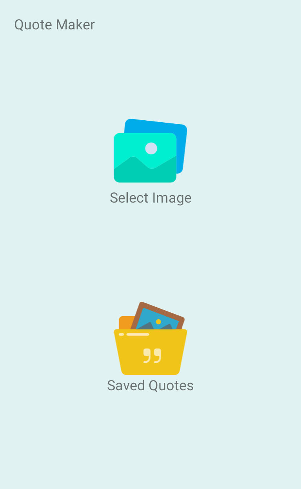
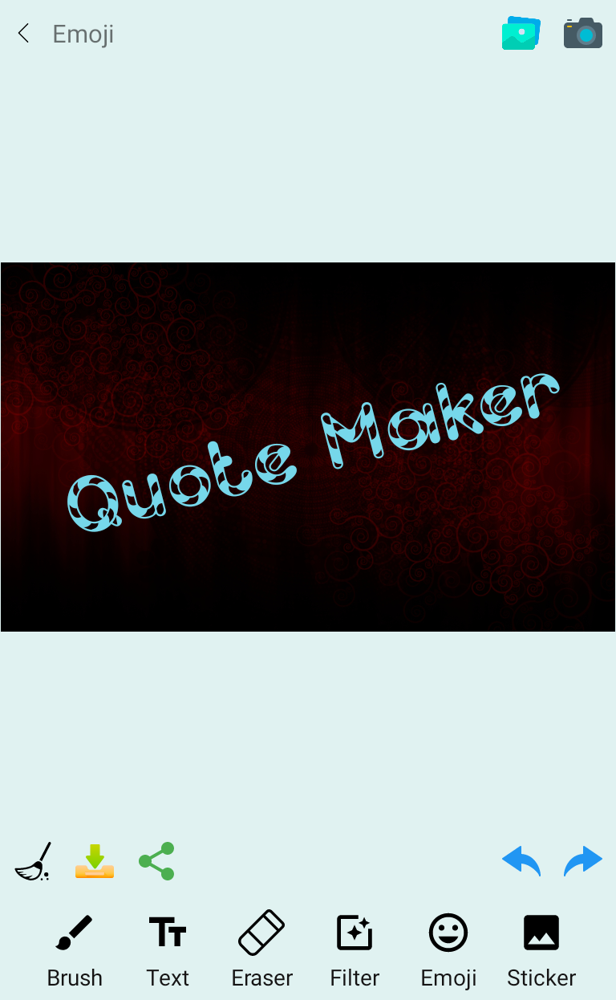

# Quote-Maker
Create Quotes easily with Quote Maker

Quote Maker is a powerful multifunctional photo editing application.  Make each your shot a perfect complete art-work using a wide range of filters,  text editing features, emojies and stickers. 
Quote Maker is used to create greetings, invite letters, best wishes , Quotes etc with your selective background,texts, colors and filters.

Features
-----------
*High image resolution based on background 
*choosy background 
*Best Clip-Arts 
*Easy Controls 
*Load background from gallery.

Download
-----------

ScreenShots
-----------

